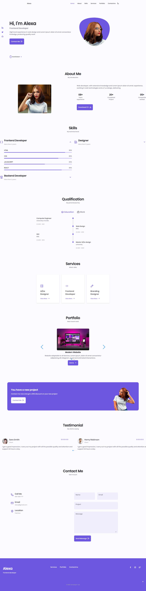

# :closed_book: Alexa-Portfolio

### _portfolio website !!_

### Link :link: https://alexa-portfolio-developer-rak.netlify.app/#skills

## Interface

## Run Locally

  - Run This command `https://github.com/developer-rak/Alexa-Portfolio.git`
  - You are now in the dev environment and you can play around

## ✨ Features

  - Nav Bar
  - Light Mode
  - Dart Mode

## ⚙️ Tech Stack
  - HTML5
  - CSS
  - JavaScript
  - Netlify
